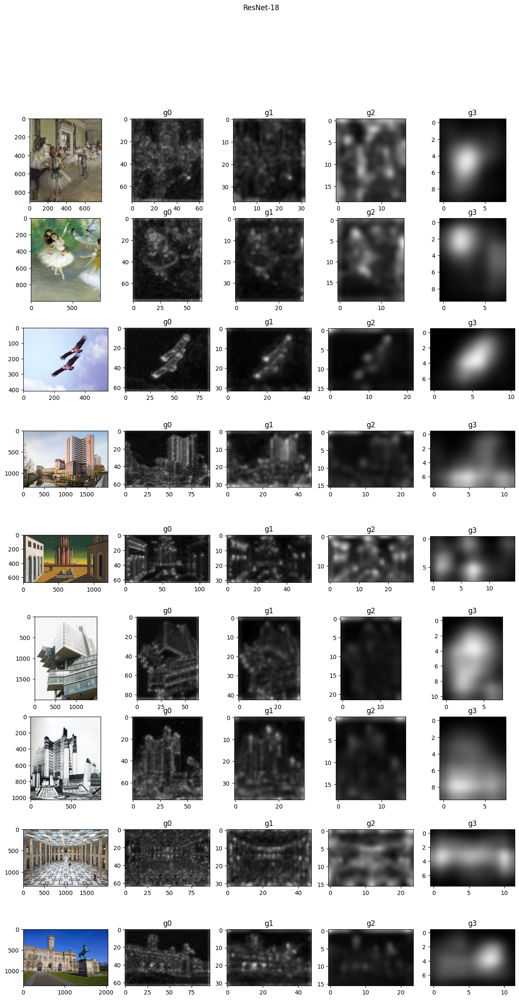
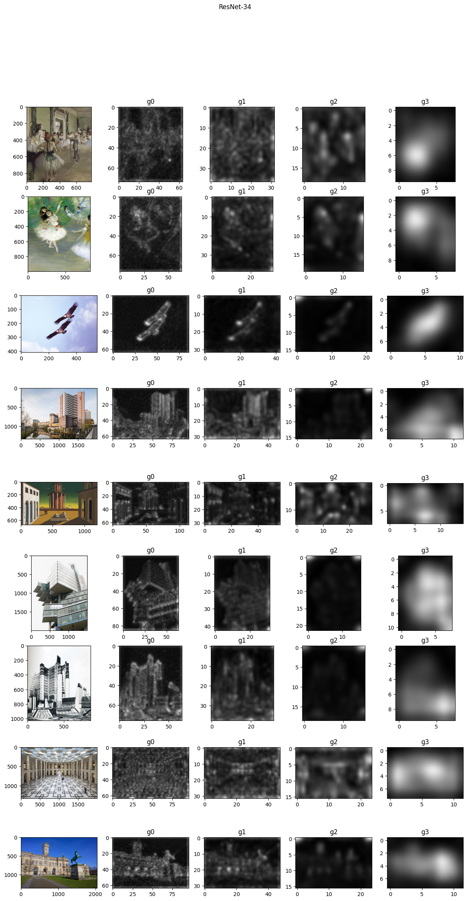
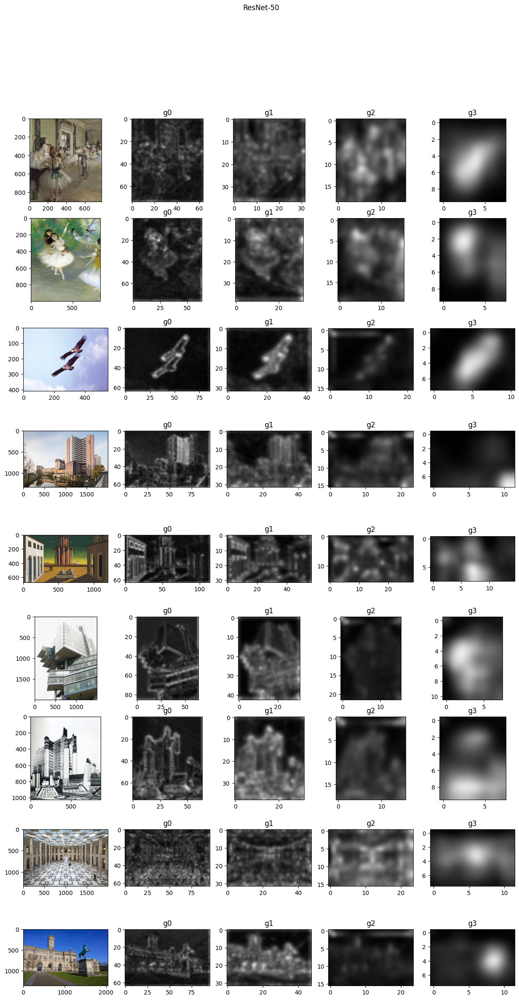
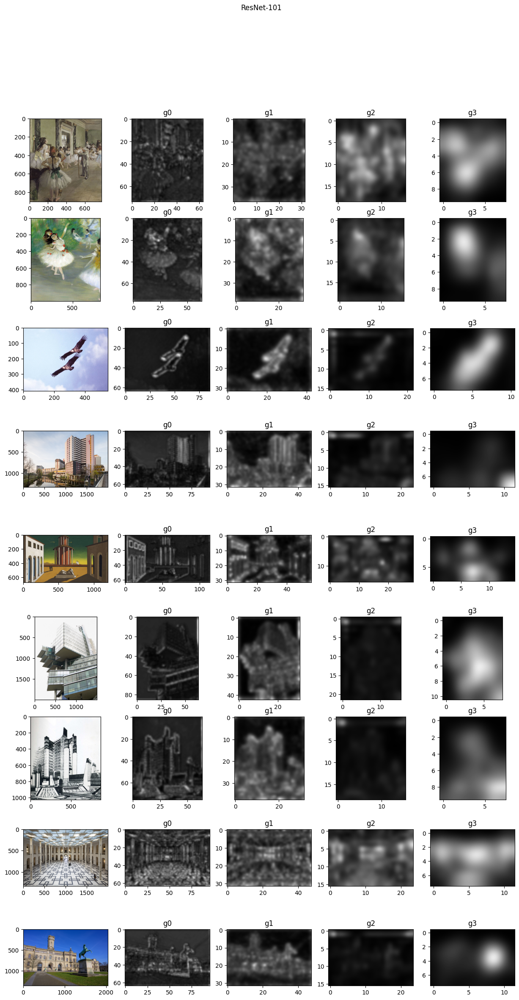
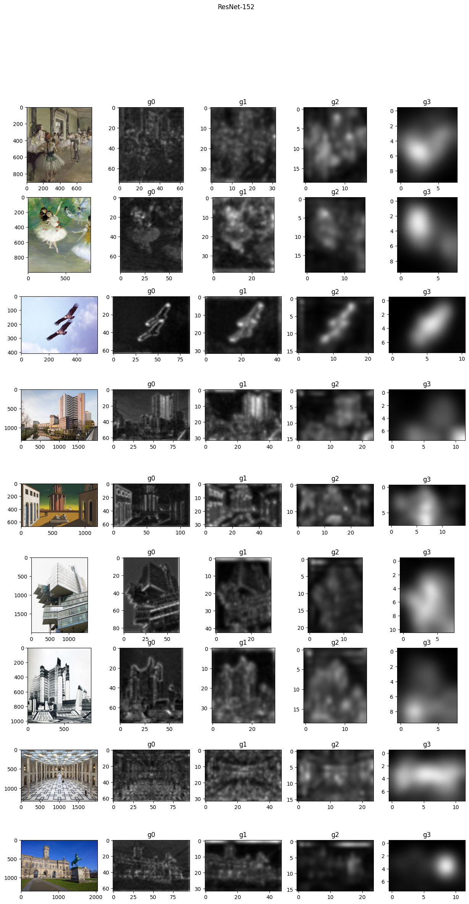

# Visualize ResNet Attention Layers 

Tool for attention visualization in ResNets inner layers.
The models used are the ``torchvision`` pretrained ones 
(see [this link](https://pytorch.org/docs/stable/torchvision/models.html)
for further details)

A modified ``ResNet`` class, called ``ResNetAT``, is available
at ``resnet_at.py``, along with the finctions to initialize
the different ResNet architectures. ``ResNetAT``'s ``forward``
method is defined sucht that the inner layers' outputs
are available as model's outputs.

## Results

|Summary|   |   |   |   |
|---|---|---|---|---|
|[ResNet18](#resnet18)|[ResNet34](#resnet34)|[ResNet50](#resnet50)|[ResNet101](#resnet101)|[ResNet152](#resnet152)|
||||||
|[ResNeXt50_32x4d](#resnext50_32x4d)|[ResNeXt101_32x8d](#resnext101_32x8d)|[WideResNet50_2](#wideresnet50_2)|[WideResNet101_2](#wideresnet101_2)|
|.png)|.png)|.png)|.png)|

## Details

### ResNet18[↑](#results)

### ResNet34[↑](#results)

### ResNet50[↑](#results)

### ResNet101[↑](#results)

### ResNet152[↑](#results)

### ResNeXt50_32x4d[↑](#results)
.png)
### ResNeXt101_32x8d[↑](#results)
.png)

### WideResNet50_2[↑](#results)
.png)
###  WideResNet101_2[↑](#results)
.png)

